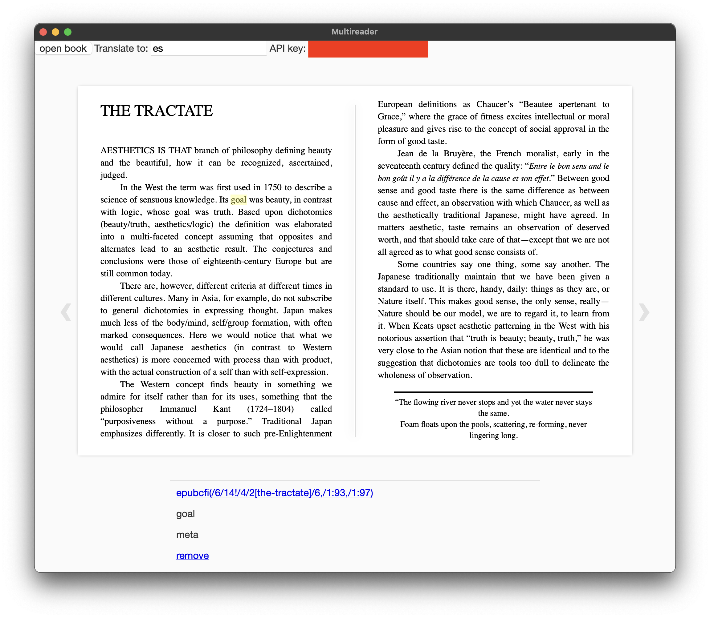

# Multireader

**note: this app is still not done!**

epub reader for learning langauges.

Reads epub files, allows for highlighting/translating text, and creating flashcards from that text.

| command | description |
| --- | --- |
| `deno task dev` | runs in basic tauri window |
| `deno task start` | runs in android emulator |
| `deno task build` | builds for android |
| `deno task test` | run fmt, lint, test |

